# 阿里云使用 KunlunBase 云数据库指南

 

## 注意：

如无特别说明，文中的版本号可以使用任何已发布版本的版本号代替。

所有已发布版本详见：http://doc.kunlunbase.com/Release_notes.html。

 

## 本文目标

指导用户在阿里云上申请使用云数据库KunlunBase计算巢，配置并使用KunlunBase的集群数据库服务。

 

## 1. 免费试用

KunlunBase 阿里云计算巢链接如下：

https://computenest.console.aliyun.com/user/cn-hangzhou/recommendService

 

### 1.1 点击 “免费试用”

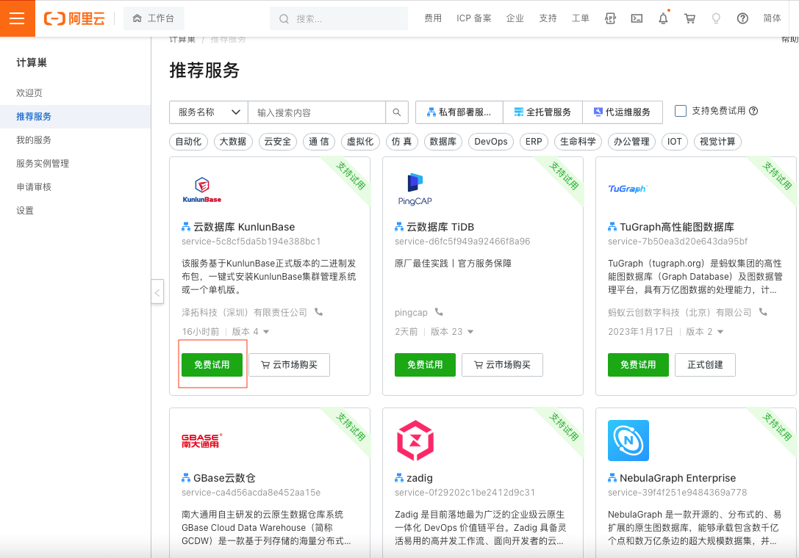

 

### 1.2 填写相应的信息，申请免费试用

选择模版，填写实例名称和选择分配实例的地域。

 

有两种套餐选择：g6 体验版和 g6 基础版。

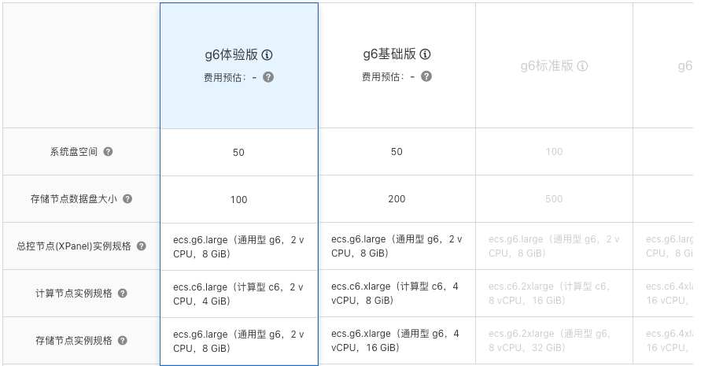

 

填写存储节点和计算节点数量，以及服务器root的密码

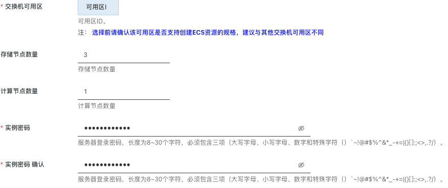

 

点击 “下一步：确认订单”。同意授权代运维和相关的服务条款。

 

最后一步点击 “开始免费试用”，与此同时会自动开始部署相关的实例。

 

大概10分钟左右就可以完成环境的部署

 

### 1.3 部署环境检查

 

部署完毕之后，一共有 5 个实例：一个计算实例，3 个存储实例，和一个运行 XPanel 的实例。

 

在概览界面可以看到 XPanel 网址、XPanel 初始用户名/密码、查看各节点日志的 Kibana 网址，还有安装 KulunBase 软件的操作用户名 klbase。

 

 

**XPanel的地址为：**

http://47.97.174.116:18080/KunlunXPanel

初始账号和密码是: super_dba/super_dba

 

**Kibana的地址为：**

http://47.97.174.116:5601

 

## 2. 云市场购买

### 2.1 点击“云市场购买”

 

### 2.2 选择购买的 “套餐版本”，“购买时长” 以及 “服务区域”。之后点击 “立即购买”

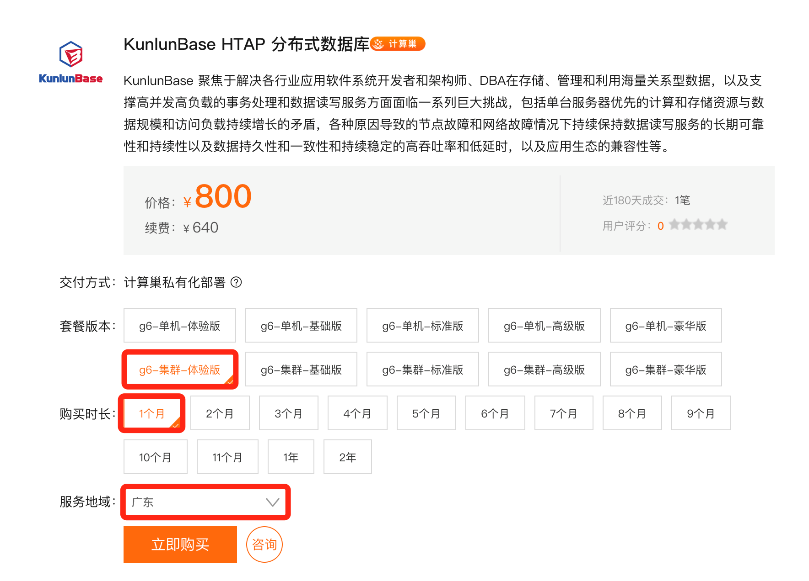

 

### 2.3 填写创建集群的信息。

服务实例名称为 Kunluntesting, 地域选择 ”华南1（深圳）”。用户可以根据自己所在的地方选择合适的地域。

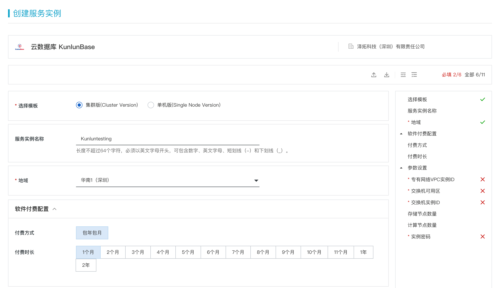

 

点击 “新建专有网络”

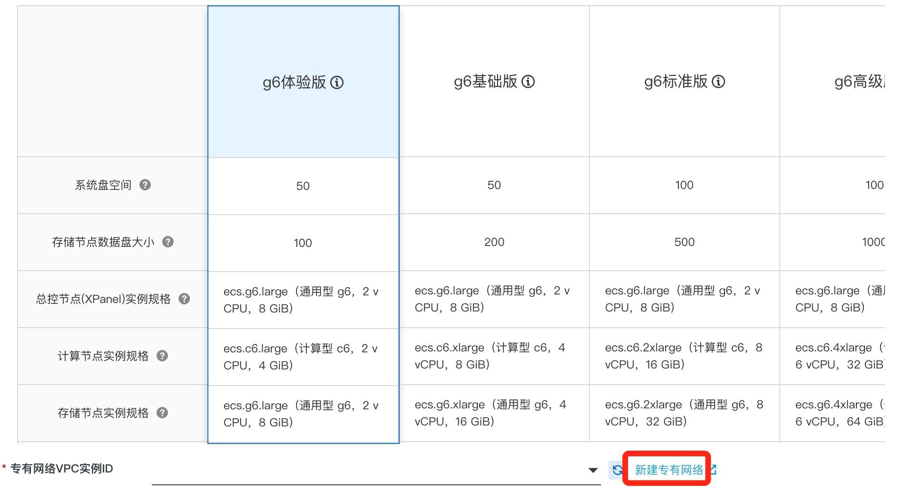

 

这时会弹出新的页面 “创建专有网络” 和 “交换机”，填入下面信息。

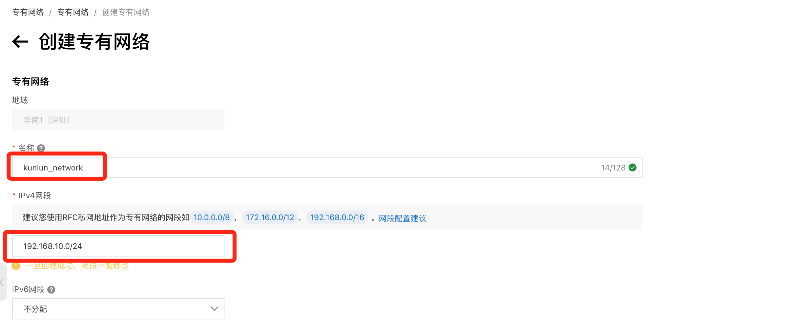

 

创建专有网络和交换机成功后，再回到之前填写创建集群信息的页面。

点击倒三角可以选择刚刚创建的 “专用网络” 和 “交换机”，并选择交换机的可用区域

 

输入实例的操作系统 root 的密码。

 

点击 “下一步：确认订单”

 

同意代运维和相关的服务条款，之后点击“立即支付”

 

扣款成功后，点击 “管理控制台”

 

在管理控制台，点击 “立即进入计算巢部署或查看部署详情”。

 

可以看到集群正在部署。

 

部署完毕后，点击 “概览”，可以看到部署集群的信息

点击 “资源”，再点击 “ECS实例”，可以看到集群各个服务器的信息。

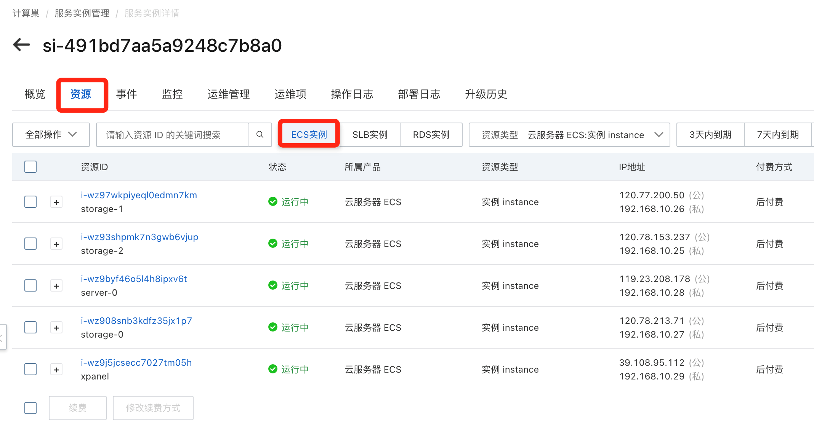

 

## 3. 在XPanel创建KulunBase集群

登录 XPanel，输入用户名 super_dba 和初始密码 super_dba。

 

登录后，需要修改初始修改密码

再以新密码重新登录 XPanel

然后创建集群，在 “集群管理” 下面 “集群列表” 页面，点击 “新增”。

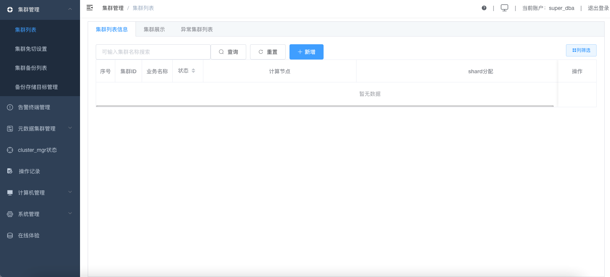

填写 “业务名称”，选择存储和计算实例，修改 shard 个数为 3，其他的栏位为默认值即可。

最后点击 “确认” 创建 KunlunBase 集群。

稍等片刻，集群创建成功。

 

在 XPanel 中还可以查看节点监控，显示节点的连接基本信息。

如果是首次登录，需要输入账户名密码，账户名密码均为 admin。

在左边栏点击 “shard列表”

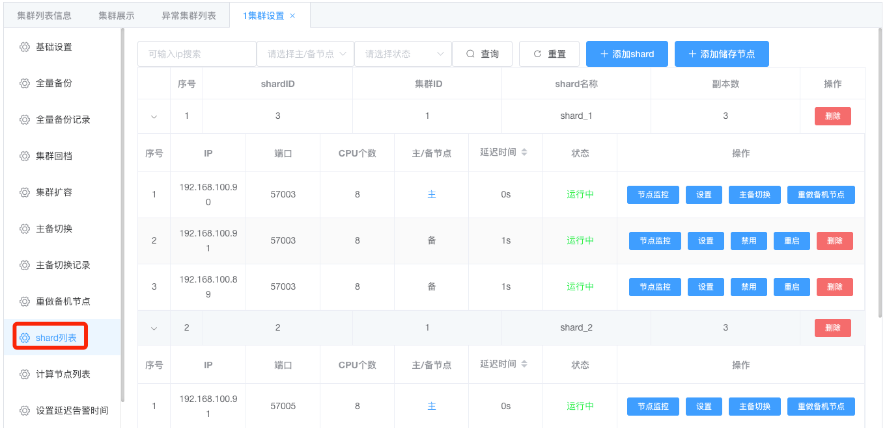

然后选择一个 shard 节点，点击 “节点监控”

然后在 Grafana 登录界面输入 admin/admin，则会展示相应节点监控的页面

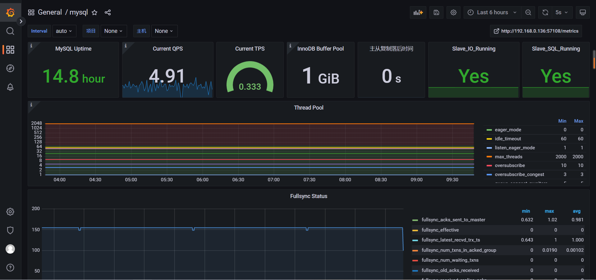

同样的可以查看计算节点的监控

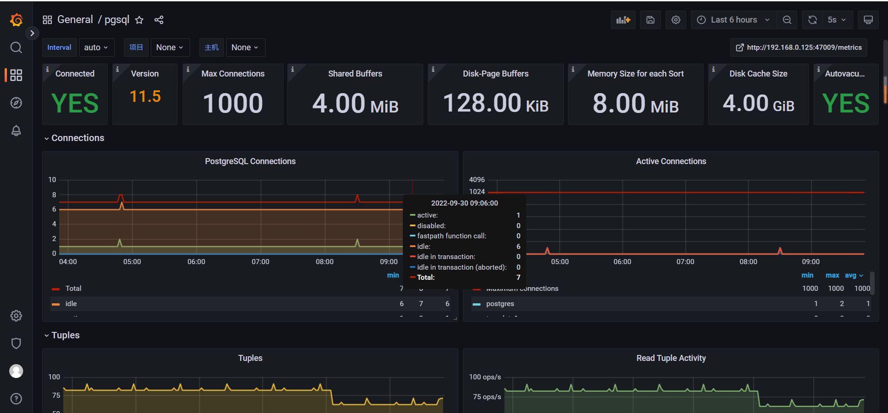

 

可以从下面链接获取其他通过 XPanel 进行集群管理操作的指导

http://doc.kunlunbase.com/XPanel_Manual.html

 

## 4. 访问计算实例

### 4.1 可以在资源页面点击“远程连接”连接相应的服务器

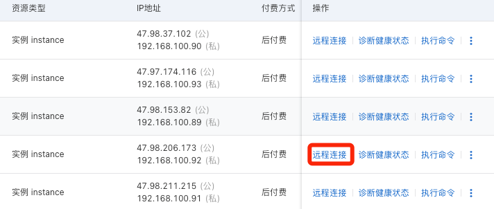

会弹出显示登录服务器的窗口

 

### 4.2 或在使用本地的 ssh 工具(putty 或其他)通过 Public IP 连接计算节点

 

上面计算节点的公网 IP 是：47.98.206.173

 

## 5. 访问计算节点数据库

登录计算实例，并切换到 klbase 用户。

通过 XPanel 集群页面知道计算节点的侦听端口为 47001

### 5.1 修改设置环境变量脚本

`[klbase@server-0 ~]$ vi ~/kunlunbase/env.sh`

将`envtype="${envtype:-no}"` 修改为`envtype="all"`

之后保存并运行`. ~/kunlunbase/env.sh`

 

5.2 计算节点私有 IP 是 192.168.100.92，通过下面的命令登录 KunlunBase 数据库

`psql -h 192.168.100.92 -p 47001 postgres`

 

## 6. 使用 Kibana 实时查看节点的日志

登录 Kibana 链接：http://47.97.174.116:5601。 参考[链接](http://doc.kunlunbase.com/KunlunBase_uses_Kibana_to_view_node_log_information.html)中的步骤添加日志索引和查看日志。

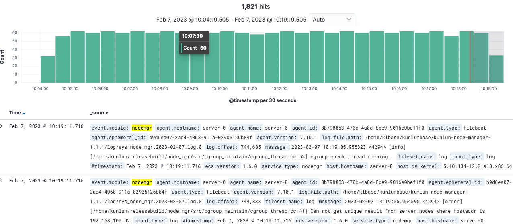

 

 

## END
